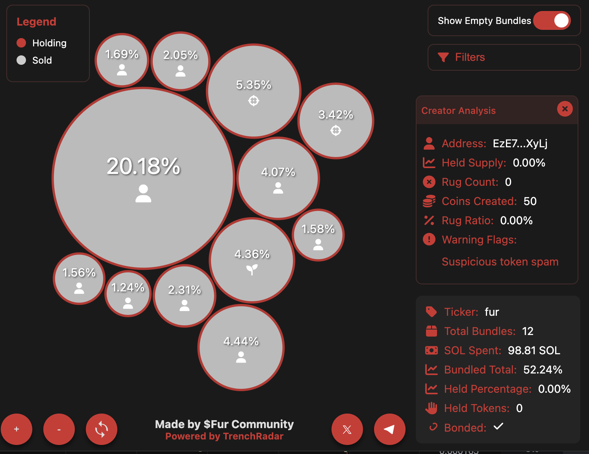
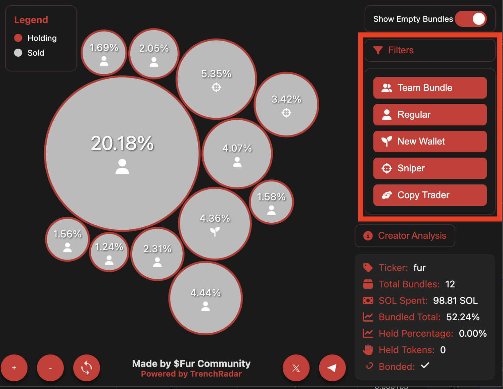
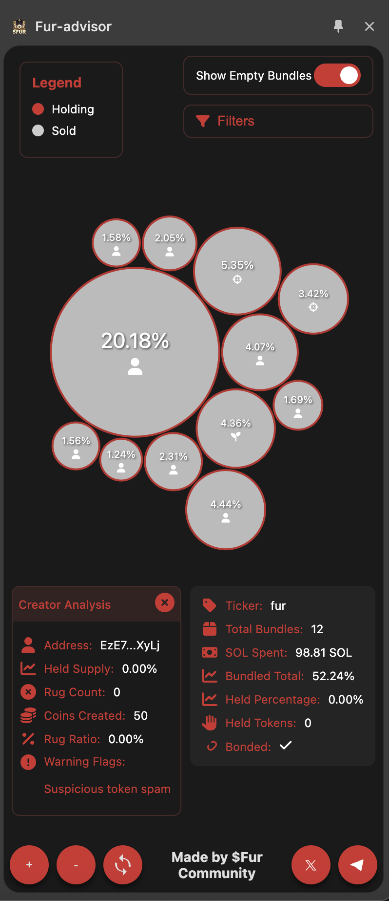

   
  
  <h1> Quickly spot the safest memecoins and avoid risks!</h1>

 

  
  
  
  

Fur-advisor helps you spot memecoin risks and make informed decisions, all directly within your browser!

## 🔥 Features

- Show bundles with automatic ca extraction on supported marketplaces.

## 📖 Extension Settings

- The extension pop-up allows you to :
  - Visualize bundles. For the supported websites the ca is extracted automatically. You also have the option to enter it manually if this fails.
  - Enable/Disable showing empty bundles.
  - Enable/Disable type of bundles you want to see:
    - Team Bundles
    - Regular Bundles
    - New wallet Bundles - Wallets created less then 1 day ago or have less then 25 transactions
    - Sniper Bundles - 2000+ pumpfun transactions or high ratio
    
  - View creator analysis - be informed if the memecoin creator has created others before and if there are risks associated.

- The extension sidepanel allows you to :
  - Same features as the popup.
  - In addition it will refresh automatically if you switch the tab to view another coin, pulling the data for the new coin.
    

## 💻 How to install on Chrome from Webstore

Currently unpublished until a new version will be approved. Currently it is pending review.

## 💻 How to install unpacked extension on Chrome, Brave, Edge, Opera V2.0 (NEW)

- Download the Release 0.0.1 zip file , unzip it, and load the unziped folder into your browser.
- <a href="https://github.com/MathFrank99/FurAdvisor-Releases/releases/tag/Release0.0.1
">Link here</a>
- <a href="https://www.youtube.com/watch?v=oswjtLwCUqg
">Watch Tutorial how to install here</a>

## 🏦 Supported Marketplaces

| Marketplace               | Status |
| ------------------------- | ------ |
| GMGN.io                   | ✅     |
| Dexscreener.com           | ✅     |
| photon-sol.tinyastro.io   | ✅     |
| pump.fun.com              | ✅     |

## 📊 Supported Tools

| Tool Site                   | Status |
| --------------------------- | ------ |
| Trench Radar Bundle Viewer  | ✅     |

## 💻 Supported Browsers

| Browser         | Status | Working Version |
| --------------- | ------ | --------------  |
| Chrome          | ✅     | 0.0.1           |
| Brave           | ✅     | 0.0.1           |
| Microsoft Edge  | ✅     | 0.0.1           |

## 🛎️ Issues

- Check latest release notes. Also please let me know if you find other issues that are not mentioned there. 

## 📈 Future developments

- Integrate more tools to help you make informed decisions (This is something that will be done periodically)

- Improve the current Creator analysis to show you previous rugs like you cna see on gmgn.io.

- Please let me know any of your wishes

## 🎯 Release History

- 0.0.1 Initial Version

